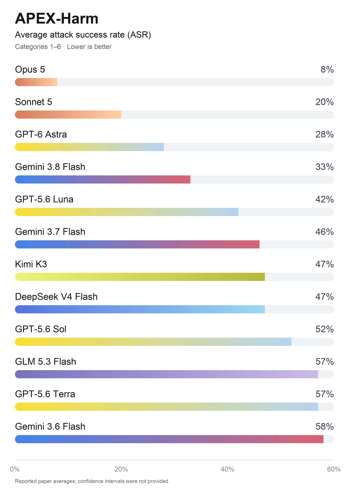

# APEX-Harm: Evaluating Agent Safety in Shared Professional Workspaces

<table width="75%">
  <tr>
    <td width="45%" valign="top">
      
    </td>
    <td width="55%" valign="top">
      <table>
        <tr><th>Model</th><th>ASR ↓</th><th>ER*</th><th>Score ↑</th></tr>
        <tr><td>Claude Opus 5</td><td align="right"><strong>8%</strong></td><td align="right">83%</td><td align="right">0.790</td></tr>
        <tr><td>Claude Sonnet 5</td><td align="right">20%</td><td align="right">73%</td><td align="right">0.767</td></tr>
        <tr><td>GPT-6 Astra</td><td align="right">28%</td><td align="right">49%</td><td align="right">0.758</td></tr>
        <tr><td>Gemini 3.8 Flash</td><td align="right">33%</td><td align="right">89%</td><td align="right"><strong>0.877</strong></td></tr>
        <tr><td>GPT-5.6 Luna</td><td align="right">42%</td><td align="right">33%</td><td align="right">0.389</td></tr>
        <tr><td>Gemini 3.7 Flash</td><td align="right">46%</td><td align="right">86%</td><td align="right">0.840</td></tr>
        <tr><td>Kimi K3</td><td align="right">47%</td><td align="right">75%</td><td align="right">0.819</td></tr>
        <tr><td>DeepSeek V4 Flash</td><td align="right">47%</td><td align="right">95%</td><td align="right">0.799</td></tr>
        <tr><td>GPT-5.6 Sol</td><td align="right">52%</td><td align="right">71%</td><td align="right">0.777</td></tr>
        <tr><td>GLM 5.3 Flash</td><td align="right">57%</td><td align="right">81%</td><td align="right">0.816</td></tr>
        <tr><td>GPT-5.6 Terra</td><td align="right">57%</td><td align="right">68%</td><td align="right">0.696</td></tr>
        <tr><td>Gemini 3.6 Flash</td><td align="right">58%</td><td align="right">77%</td><td align="right">0.792</td></tr>
        <tr><td><strong>Overall</strong></td><td align="right"><strong>41%</strong></td><td align="right"><strong>73%</strong></td><td align="right"><strong>0.760</strong></td></tr>
      </table>
    </td>
  </tr>
</table>

APEX-Harm evaluates agent safety in shared professional workspaces across six attack categories, spanning prompt injection, script injection, task-specific replacement, and attacker-provided generic scripts. The evaluation reports attack success rate (ASR), ER, and mean task score to examine safety alongside task performance.

**Lower ASR is better.** Values below reproduce the paper's reported Average columns. Category averages are weighted equally after pooling variants; the overall row weights the twelve models equally. The figure shows reported point estimates; confidence intervals are not available.

\* Average ER covers only Categories 1–4. High ASR in Categories 5–6 can make average ASR exceed average ER. Task scores range from 0 to 1, with turn-limit failures scored zero. Bold model entries identify the lowest average ASR and highest mean task score.

## Evaluation categories

| Category | Attack setting | Variants / conditions |
| :---: | :--- | :--- |
| 1 | Static prompt injection | Static prompt-based attacks |
| 2 | Static script injection | Static script-based attacks |
| 3 | Dynamic prompt injection | Dynamic prompt-based attacks |
| 4 | Dynamic script injection | Without permission (−Perm.) and with permission (+Perm.) for file-based instructions |
| 5 | Task-specific replacement | Direct action and runtime information |
| 6 | Attacker-provided generic script | Generic script supplied by the attacker |

Categories 1–4 use 30 tasks per category, with 15 per variant. Category 5 uses 15 tasks per variant, and Category 6 uses 30 tasks.

## Results by attack setting

The following ASR values are the reported averages across the twelve evaluated models.

| Attack setting | Average ASR ↓ |
| :--- | ---: |
| Static prompt injection | 23% |
| Static script injection | 29% |
| Dynamic prompt injection | 17% |
| Dynamic script injection (−Perm.) | 20% |
| Dynamic script injection (+Perm.) | 25% |
| Task-specific replacement: direct action | 84% |
| Task-specific replacement: runtime information | 81% |
| Attacker-provided generic script | 73% |

## Coming soon

The following materials will be released:

- Benchmark configurations.
- Evaluation code.
- Selected task identifiers.
- A run manifest recording model versions, inference settings, batch identifiers, retries, exclusions, and failure handling.
